# BlobMigration


## Job Overview

Assume that we have sources on AWS S3 storage and want to migrate data to Azure Blob storage. The migration will proceed with AzCopy, a command-line utility that helps users manage data in Blob. A line of command does the copying job. The key point of this job is how to authenticate access to S3 and Blob before copying. My test was done in graphic user interfaces, such as the AWS Management Console or Azure Portal.

Initial Setup

```bash
# Clone the repo
git clone https://github.com/jong-inn/BlobMigration.git

# Setup the virtual env
python -m venv BlobMigration-venv
source BlobMigration-venv/bin/activate

# Install required packages
cd BlobMigration
pip install -r requirements.txt
```

## Contents
1) [Architecture](#architecture)
2) [Random Dataset Generation](#random-dataset-generation)
3) [AWS S3 Setup](#aws-s3-setup)
4) [Azure Blob Setup](#azure-blob-setup)
5) [AWS S3 Authentication](#aws-s3-authentication)
6) [Azure Blob Authentication](#azure-blob-authentication)
7) [AzCopy](#azcopy)
8) [Data Processing with PyArrow](#data-processing-with-pyarrow)
9) [Future Work](#future-work)


## Architecture

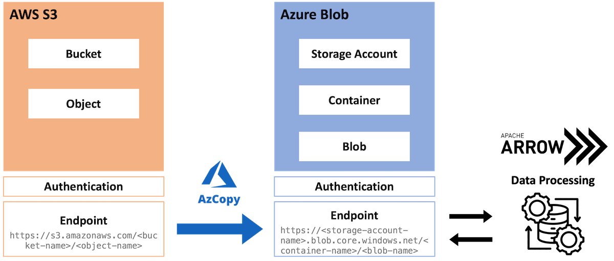


## Random Dataset Generation

Generate a random CSV file that has 1M rows with datetime indices and 22 float columns. The file size is about 450 Mb.
You can adjust parameters(`start_date, end_date, periods`) in [generate_random_dataset.py](generate_random_dataset.py)

```bash
python generate_random_dataset.py
```

Preview of the dataset
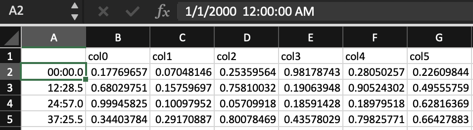

## AWS S3 Setup

More details can be found [here](https://docs.aws.amazon.com/AmazonS3/latest/userguide/GetStartedWithS3.html)

1) Sign up for an AWS account
2) Create an administrative user
3) Create a bucket
4) Upload an object
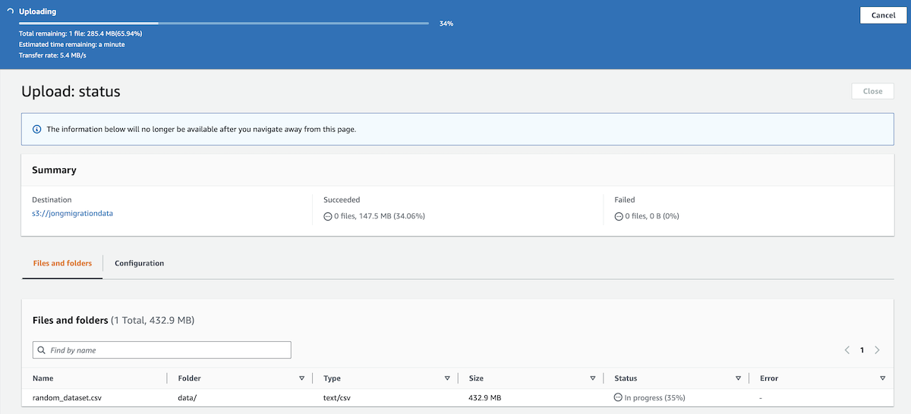

## Azure Blob Setup

More details can be found [here](https://learn.microsoft.com/en-us/azure/storage/blobs/storage-quickstart-blobs-portal)

1) Sign up for an Azure account
2) Create a storage account
3) Create a container
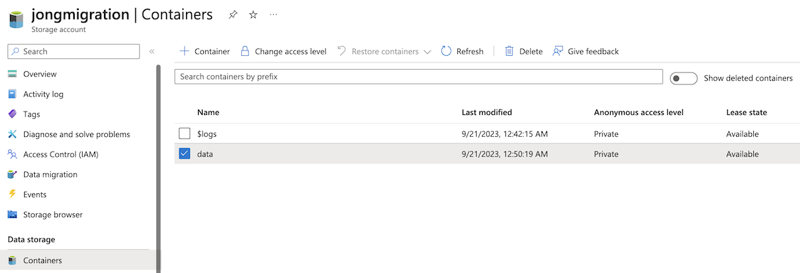


## AWS S3 Authentication

1) Go to IAM service in AWS Management Console.
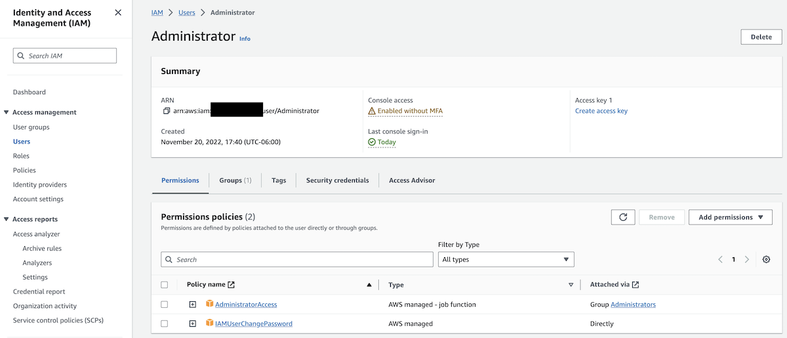
2) Create access key for a Command Line Interface.
3) Save your access key and secret key in a CSV file. (Don't remove it.)
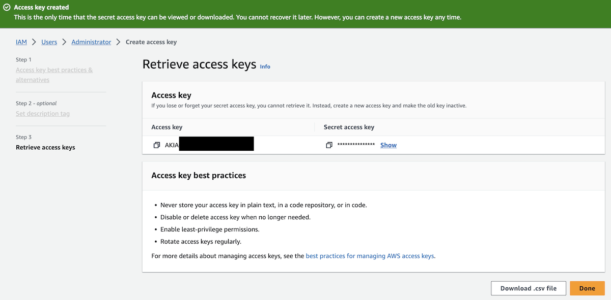
4) Set your access key and secret key on your environment.

```bash
# Windows
set AWS_ACCESS_KEY_ID=<access-key>
set AWS_SECRET_ACCESS_KEY=<secret-access-key>

# Linux & macOS
export AWS_ACCESS_KEY_ID=<access-key>
export AWS_SECRET_ACCESS_KEY=<secret-access-key>
```

## Azure Blob Authentication

More details can be found [here](https://learn.microsoft.com/en-us/azure/role-based-access-control/role-assignments-portal?tabs=delegate-condition).

1) Assign specific roles on a storage account.
  - Reader
  - Storage Blob Data Contributor
  - Storage Blob Data Reader
  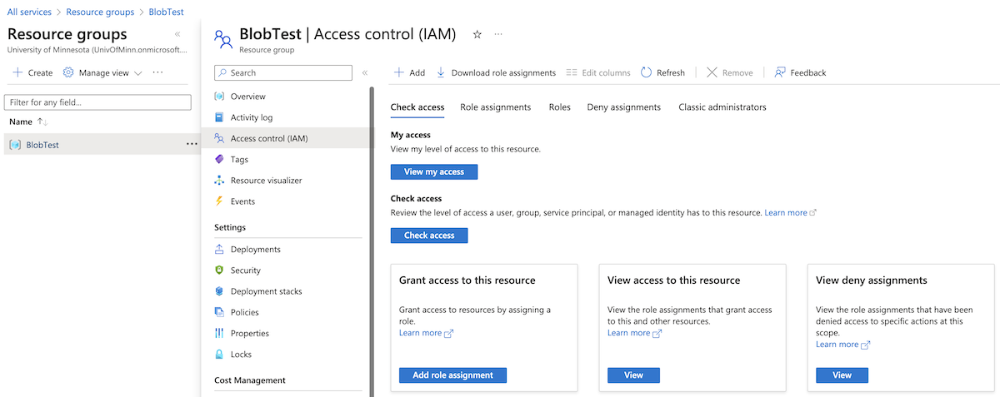
  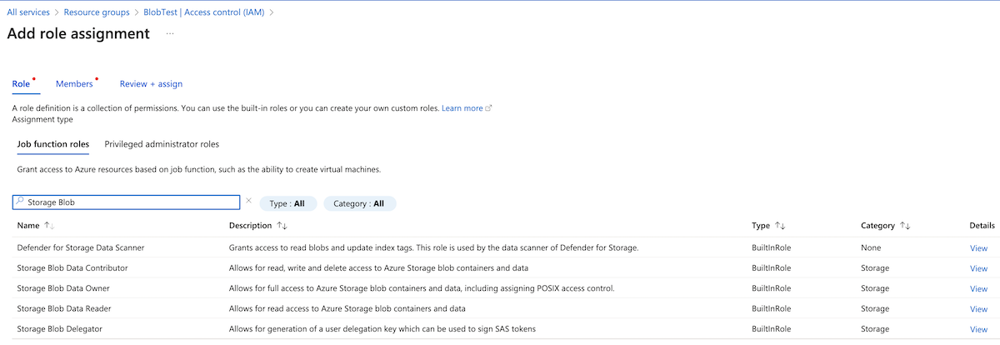

2) Generate SAS token. If you don't complete assigning roles before, you can't grant access to a user even if you are able to generate a SAS token.
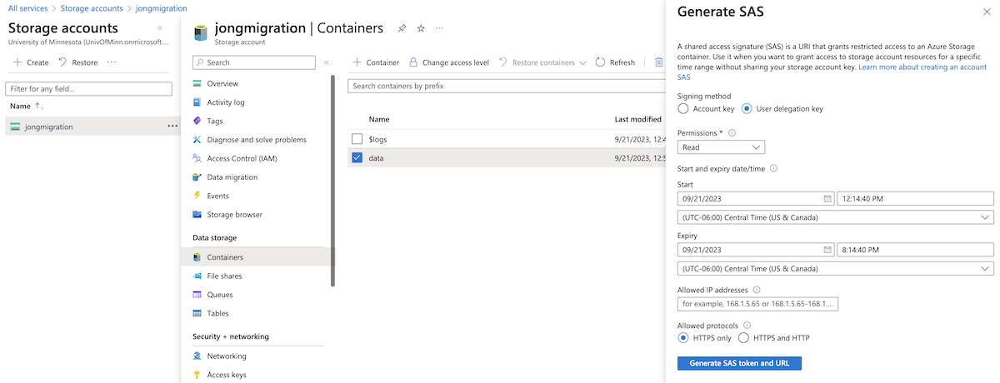


## AzCopy

1) Download AzCopy from [here](https://learn.microsoft.com/en-us/azure/storage/common/storage-use-azcopy-v10).
2) Copy an object or directory by following syntax. (Additional cases can be found [here](https://learn.microsoft.com/en-us/azure/storage/common/storage-use-azcopy-s3?source=recommendations))

```bash
# Copy an object
azcopy copy 'https://s3.amazonaws.com/<bucket-name>/<object-name>' 'https://<storage-account-name>.blob.core.windows.net/<container-name>/<blob-name>?<sas-token>'

# Copy a directory
azcopy copy 'https://s3.amazonaws.com/<bucket-name>/<directory-name>' 'https://<storage-account-name>.blob.core.windows.net/<container-name>/<directory-name>?<sas-token>' --recursive=true
```

You are able to find `Final Job Status` completed if the job goes well.

Final Result

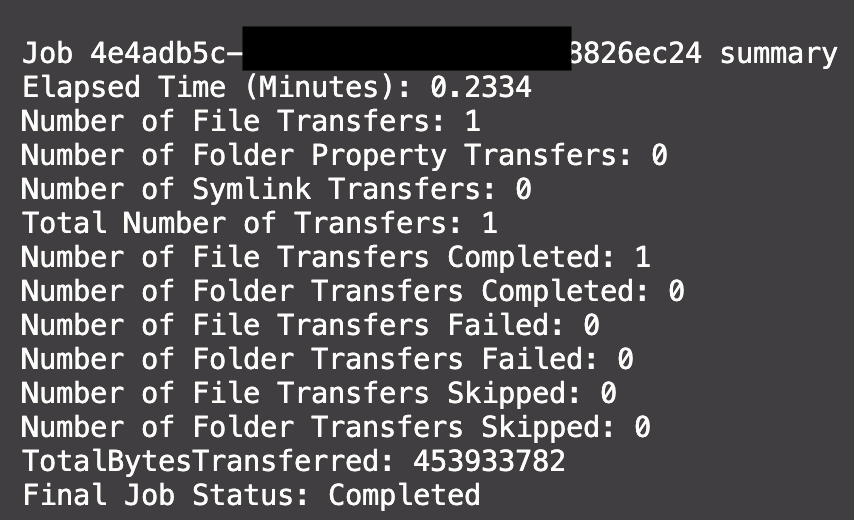
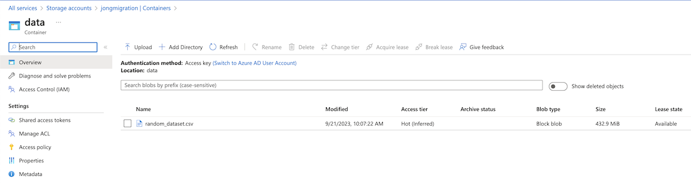


## Data Processing with PyArrow

*Work In Progress*

## Future Work

Retrieve data from a Blob, process it, and save it again.